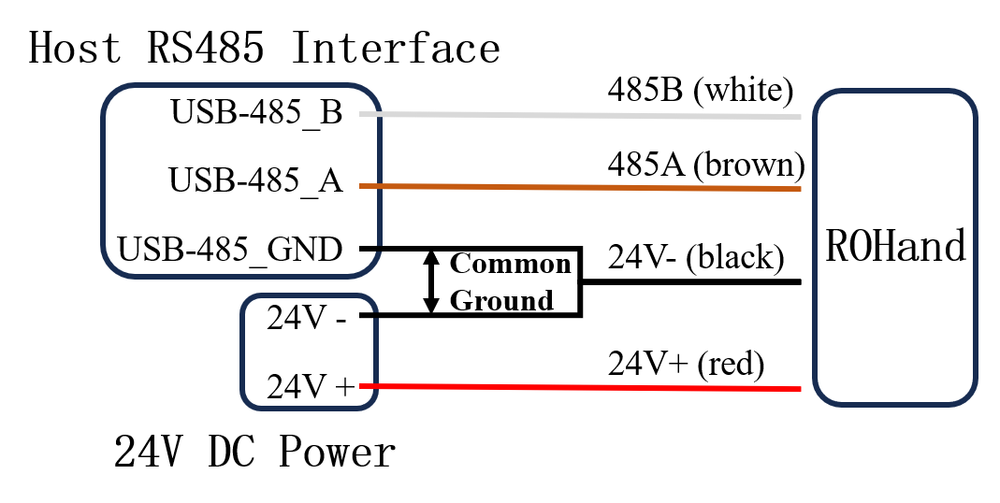
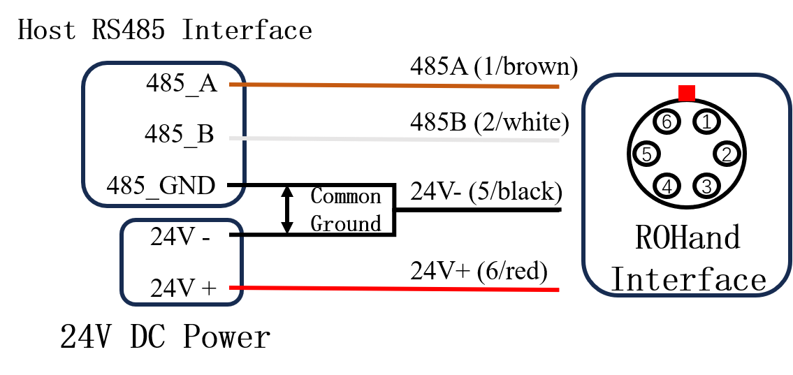
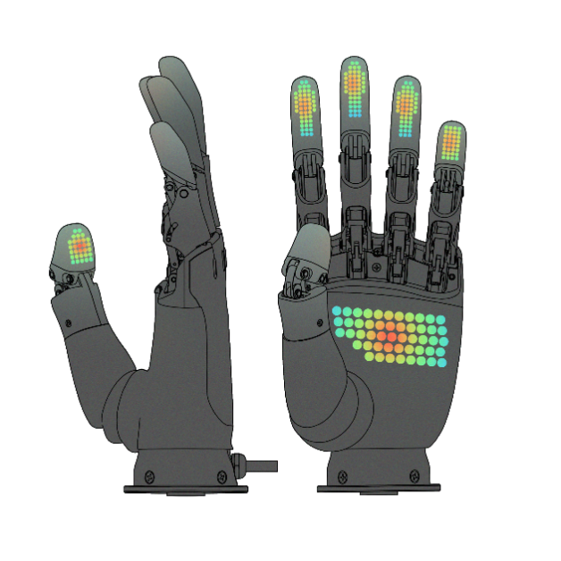

# ROHand FAQ

## Hardware

### 1. Q: How do I connect ROHand?

**A:** ROHand uses a four-core cable from the wrist with this color coding:

| Color | Definition    |
| :---: | :------------ |
|  Red  | Power 24 V+   |
| Black | Power 24 V-   |
| Brown | RS485_A/CAN_L |
| White | RS485_B/CAN_H |

**Important:** When using separate power supplies for host and ROHand, establish common ground by shorting the power supply negative to the USB-to-485 module's GND.



**Connection to robotic arms (e.g., RM65):**

|  Pin  | Color | Definition    |
| :---: | :---: | :------------ |
|   1   | Brown | RS485_A       |
|   2   | White | RS485_B       |
|   3   |   -   | Not connected |
|   4   |   -   | Not connected |
|   5   | Black | Power 24 V-   |
|   6   |  Red  | Power 24 V+   |

Wiring diagram:  


---

### 2. Q: How do I troubleshoot ROHand communication issues or failed firmware updates?

**A:** Follow these steps:

1. Confirm you're using OYMotion's USB-to-RS485 module
2. Check for loose connections or damaged wiring
3. Verify proper common grounding (refer to wiring diagram)
4. If issues persist, connect the 120Ω termination resistor by shorting A and R ports
5. Contact technical support if problems continue

---

### 3. Q: What is ROHand's operating voltage range?

**A:** ROHand operates at 12-26 V DC with these specifications:

- Rated voltage: 24 V
- Rated power: 48 W  
**Note:** The buzzer pulses when voltage drops below required levels.

---

### 4. Q: What are ROHand's current specifications?

**A:** (1st generation at 24 V):

- Standby current: ~0.12 A
- No-load motion current: ~0.25 A
- Peak gripping current: ~2.0 A

---

### 5. Q: Why is there continuous current at the zero position, and why won't the thumb rotation zero completely?

**A:** This is normal behavior:

- PID control maintains position accuracy at zero
- Thumb has a deliberate 1° offset to reduce skin stress

---

### 6. Q: Why do fingers extend fully during calibration?

**A:** The startup self-test extends all fingers. If fingers don't extend:

1. Check for mechanical damage:
   - Broken springs between joints
   - Detached screw nuts/connectors
   - Debris in screw mechanisms
2. Check for finger interference (thumb/index finger)

---

## Software

### 1. Q: How do I program ROHand?

**A:** Use ModBus-RTU protocol to write to position registers:

- Registers: `ROH_FINGER_POS_TARGET0` to `ROH_FINGER_POS_TARGET5`
- Values: 0 (fully open) to 65535 (fully closed)  
Thumb rotation: 0° (side) to 90° (palm) at 65535  

Reference:  
[roh_registers_v2.h](../protocol/roh_registers_v2.h) / [roh_registers_v2.py](../protocol/roh_registers_v2.py)  
Sample code: Appendix 1

---

### 2. Q: How do I read/control finger angles?

**A:**
**Read angles:**  
Registers `ROH_FINGER_ANGLE0` to `ROH_FINGER_ANGLE5`  
Values: Signed integers = actual angle × 100  

**Set angles:**  
Write to `ROH_FINGER_ANGLE_TARGET0` to `ROH_FINGER_ANGLE_TARGET5`  
Input: Signed integers = desired angle × 100  

**Example:**  
Set index finger to 101.01° → Write 10101 to `ROH_FINGER_ANGLE_TARGET1`  

**Note:** Angles measured between first joint and palm plane.  
Protocol: [OHandModBusRTUProtocol_CN.md](../protocol/OHandModBusRTUProtocol_CN.md)

---

### 3. Q: How do I determine finger angle ranges?

**A:** Actual ranges vary per unit. To measure:  

1. Write 0 to `ROH_FINGER_POS_TARGETx` → Read `ROH_FINGER_ANGLEX` (min angle)
2. Write 65535 → Read register (max angle)  

Sample code: Appendix 2

---

### 4. Q: How can I detect object grasping?

**A:** Depends on model:

**ROH-AP001 (with force feedback):**  

- Uses piezoresistive matrix sensors
- Read combined force: `ROH_FINGER_FORCE0`-`ROH_FINGER_FORCE5`
- Read individual sensors: `ROH_FINGER_FORCE_EX0`-`ROH_FINGER_FORCE_EX9`  


**ROH-LiteS001:**  

- Detect grasping via `ROH_FINGER_STATUS0`-`ROH_FINGER_STATUS5`
- Status code 5 (`STATUS_STUCK`) indicates contact

---

### 5. Q: Why do fingers shake during movement?

**A:** Caused by suboptimal PID tuning. Adjust parameters using OHandSetting.exe.

---

### 6. Q: What are ROHand's maximum baud rate and command frequency?

**A:**

- **RS485:** Auto-baud 9200-460800 bps
- At 115200 bps: 60 Hz command rate
- With bundling: 90-100 Hz
- **CAN:** 1 Mbps baud rate

---

### 7. Q: What control modes are available?

**A:** ROH-A001 supports:

- **Position Control:** Direct motor positioning
- **Angle Control:** Converts angles to positions

---

### 8. Q: What algorithm controls the motors?

**A:** PID-based position control with:

- Real-time speed/current monitoring
- Stall protection (>500mA → pulsed retries)
- Heat reduction logic (Appendix 3)

---

### 9. Q: How do I install USB-to-485 drivers on Ubuntu?

**A:**

1. Install CH340 driver: [Download](https://www.wch.cn/downloads/CH341SER_EXE.html)
2. Device appears as `/dev/ttyUSB0`
3. Verify: `ls /dev/ttyUSB*`
4. If missing, check for `brltty` conflicts

---

### 10. Q: How do I prevent shaking and overheating?

**A:**

- Avoid frequent target updates
- Implement directional control (Appendix 4)
- Send commands only when direction changes

---

### 11. Q: How do I use force control mode (ROH-AP001)?

**A:**

1. Reset force module: Write 1 to `ROH_RESET_FORCE`
2. Set target forces: `ROH_FINGER_FORCE_TARGET0`-`ROH_FINGER_FORCE_TARGET4`
3. To exit: Set targets to 0

Sample code: Appendix 5

---

## Appendices

### Appendix 1: Basic Control

```python
import time

from pymodbus import FramerType
from pymodbus.client import ModbusSerialClient
from roh_registers_v2 import *

COM_PORT = 'COM1'
NODE_ID = 2

client = ModbusSerialClient(COM_PORT, FramerType.RTU, 115200)
client.connect()

if __name__ == "__main__":

    # Make a fist
    resp = client.write_registers(ROH_FINGER_POS_TARGET1, [65535, 65535, 65535, 65535, 65535], NODE_ID)
    time.sleep(2)
    resp = client.write_registers(ROH_FINGER_POS_TARGET0, 65535, NODE_ID)
    time.sleep(2)

    # Open
    resp = client.write_registers(ROH_FINGER_POS_TARGET0, 0, NODE_ID)
    time.sleep(2)
    resp = client.write_registers(ROH_FINGER_POS_TARGET1, [0, 0, 0, 0, 0], NODE_ID)
    time.sleep(2)

    # Write finger angle, the value written is actual value * 100
    real_angle = 15.05
    target_angle = round(real_angle * 100)

    if (target_angle < 0) :
        target_angle += 65536

    resp = client.write_registers(ROH_FINGER_ANGLE_TARGET0, [target_angle], NODE_ID)
    time.sleep(2)
    
    # Read the current finger angle, the actual value is output value / 100
    resp = client.read_holding_registers(ROH_FINGER_ANGLE0, 1, NODE_ID)
    current_angle = resp.registers

    if (current_angle > 32767) :
        current_angle -= 65536

    current_angle = current_angle  / 100.0

    print("Current finger angle：", current_angle)
```

### Appendix 2: Measure Angle Ranges

```python
import time

from pymodbus import FramerType
from pymodbus.client import ModbusSerialClient
from roh_registers_v2 import *

COM_PORT = 'COM1'
NODE_ID = 2

client = ModbusSerialClient(COM_PORT, FramerType.RTU, 115200)
client.connect()

if __name__ == "__main__":

    # Make a fist
    resp = client.write_registers(ROH_FINGER_POS_TARGET1, [65535, 65535, 65535, 65535, 65535], NODE_ID)
    time.sleep(2)
    resp = client.write_registers(ROH_FINGER_POS_TARGET0, 65535, NODE_ID)
    time.sleep(2)

    # Open
    resp = client.write_registers(ROH_FINGER_POS_TARGET0, 0, NODE_ID)
    time.sleep(2)
    resp = client.write_registers(ROH_FINGER_POS_TARGET1, [0, 0, 0, 0, 0], NODE_ID)
    time.sleep(2)

    # Write finger angle, the value written is actual value * 100
    real_angle = 15.05
    target_angle = round(real_angle * 100)

    if (target_angle < 0) :
        target_angle += 65536

    resp = client.write_registers(ROH_FINGER_ANGLE_TARGET0, [target_angle], NODE_ID)
    time.sleep(2)
    
    # Read the current finger angle, the actual value is output value / 100
    resp = client.read_holding_registers(ROH_FINGER_ANGLE0, 1, NODE_ID)
    current_angle = resp.registers

    if (current_angle > 32767) :
        current_angle -= 65536

    current_angle = current_angle  / 100.0

    print("Current finger angle：", current_angle)
```

### Appendix 3: Reduce Heat from Motor Stalls


```python
# Sample code to get glove data and controls ROHand via ModBus-RTU protocol

import asyncio
import os
import signal
import sys
import time

from pymodbus import FramerType
from pymodbus.client import ModbusSerialClient

from roh_registers_v2 import *

# ROHand configuration
COM_PORT = "COM1"
NODE_ID = 2
NUM_FINGERS = 6

current_dir = os.path.dirname(os.path.realpath(__file__))
parent_dir = os.path.dirname(current_dir)
sys.path.append(parent_dir)


class Application:

    def __init__(self):
        signal.signal(signal.SIGINT, lambda signal, frame: self._signal_handler())
        self.terminated = False

    def _signal_handler(self):
        print("You pressed ctrl-c, exit")
        self.terminated = True

    def write_registers(self, client, address, values, node_id):
        resp = client.write_registers(address, values, node_id)
        if resp.isError():
            print("client.write_registers() returned", resp)
            return False
        else :
            return True

    async def main(self):
        client = ModbusSerialClient(COM_PORT, FramerType.RTU, 115200)
        client.connect()

        self.write_registers(client, ROH_FINGER_SPEED0, [65535, 65535, 65535, 65535, 65535], NODE_ID)

        # Open all fingers
        self.write_registers(client, ROH_FINGER_POS_TARGET0, [0, 0, 0, 0, 0], NODE_ID)
        time.sleep(1.5)

        # Rotate thumb root to opposite
        print("Moving thumb root...")
        status_tmbRoot = client.read_holding_registers(ROH_FINGER_STATUS5, 1, NODE_ID)

        while status_tmbRoot.registers == 5:
            print("Thumb root stuck, retrying...")
            self.write_registers(client, ROH_FINGER_POS_TARGET5, [0], NODE_ID)
            status = client.read_holding_registers(ROH_FINGER_STATUS5, 1, NODE_ID)

        self.write_registers(client, ROH_FINGER_POS_TARGET5, [65535], NODE_ID)
        time.sleep(1.5)

        pos = [65535, 65535, 65535, 65535, 65535]
        pos_copy = pos.copy()

        while not self.terminated:

            status = client.read_holding_registers(ROH_FINGER_STATUS0, 5, NODE_ID)

            for i in range(5):
                if status.registers[i] == 5:
                    print("Finger", i, "is stuck")
                    # If finger is stuck, set target position to current position
                    resp = client.read_holding_registers(ROH_FINGER_POS0 + i, 1, NODE_ID)
                    pos_copy[i] = resp.registers
                else:
                    pos_copy[i] = pos[i]

            self.write_registers(client, ROH_FINGER_POS_TARGET0, pos, NODE_ID)


if __name__ == "__main__":
    app = Application()
    asyncio.run(app.main())
```

### Appendix 4: Prevent Shaking/Overheating

```python

# The threshold for determining the change in target position is an integer in position control mode and a floating-point number in angle control mode
TOLERANCE = 10 

prev_dir = [0 for _ in range(NUM_FINGERS)]
prev_finger_data = [0 for _ in range(NUM_FINGERS)]

while True:
    finger_data = get_latest_data() # Obtain target position/angle

    dir = [0 for _ in range(NUM_FINGERS)]

    for i in range(NUM_FINGERS):
        if finger_data[i] > prev_finger_data[i] + TOLERANCE:
            dir[i] = 1
        elif finger_data[i] < prev_finger_data[i] - TOLERANCE:
            dir[i] = -1

        # Only send target position/angle when there is a change in direction
        if dir[i] != prev_dir[i]:
            prev_finger_data[i] = finger_data[i]
            prev_dir[i] = dir[i]

            if dir[i] == -1:
                pos = 0
            elif dir[i] == 0:
                pos = finger_data[i]
            else:
                pos = 65535

            resp = client.write_register(ROH_FINGER_POS_TARGET0 + i, pos, NODE_ID)
            print(f"client.write_register({ROH_FINGER_POS_TARGET0 + i}, {pos}, {NODE_ID}) returned", resp)
```

### Appendix 5: Force Control Mode (ROH-AP001)

```python

from roh_registers_v2 import *
from pymodbus import FramerType
from pymodbus.client import ModbusSerialClient
from pymodbus.exceptions import ModbusException
from serial.tools import list_ports

# Hand configuration
NUM_FINGERS = 5
NODE_ID = 2
FORCE_VALUE_LENGTH = [17, 30, 30, 30, 16, 27]

def find_comport(port_name):
    ports = list_ports.comports()
    for port in ports:
        if port_name in port.description:
            return port.device
    return None

def write_registers(client, address, values):
    try:
        resp = client.write_registers(address, values, NODE_ID)
        if resp.isError():
            print("client.write_registers() returned", resp)
            return False
        return True
    except ModbusException as e:
        print("ModbusException:{0}".format(e))
        return False

def read_registers(client, address, count):
    try:
        resp = client.read_holding_registers(address, count, NODE_ID)
        if resp.isError():
            return None    
        return resp.registers
    except ModbusException as e:
        print("ModbusException:{0}".format(e))
        return None

def main():
    client = ModbusSerialClient(find_comport("CH340"), FramerType.RTU, 115200)
    if not client.connect():
        print("Failed to connect to Modbus device")
        exit(-1)

    if not write_registers(client, ROH_RESET_FORCE, 1):
        print("Failed to reset force")

    if not write_registers(client, ROH_FINGER_FORCE_TARGET0, [500, 500, 500, 500, 500]):
        print("Failed to write target force")

    resp = read_registers(client, ROH_FINGER_FORCE0, NUM_FINGERS)
    if resp is None:
        print("Failed to read force summation")
    else:
        print(resp)

    for i in range(NUM_FINGERS):
        reg_cnt = FORCE_VALUE_LENGTH[i]
        resp = read_registers(client, ROH_FINGER_FORCE_EX0 + i * FORCE_GROUP_SIZE, reg_cnt)
        if resp is None:
            print("Failed to read single dot force")

        if len(resp) == reg_cnt:
            force_dot = []
            for j in range(reg_cnt):
                force_dot.append((resp[j] >> 8) & 0xff)
                force_dot.append(resp[j] & 0xff)
            print(force_dot)

    if not write_registers(client, ROH_FINGER_FORCE_TARGET0, [0, 0, 0, 0, 0]):
        print("Failed to write target force")

    client.close()

if __name__ == "__main__":
    main()
```
